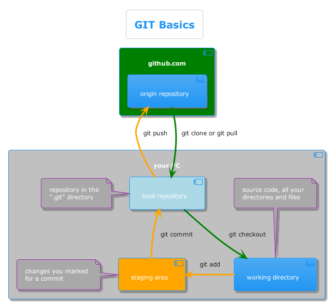

#### GIT?

- git is a distributed repository for source code
- git is basically terminal based (although it has graphical apps)
- git is your best friend, if you code

<!-- .element style="height:500px; background: white" -->

