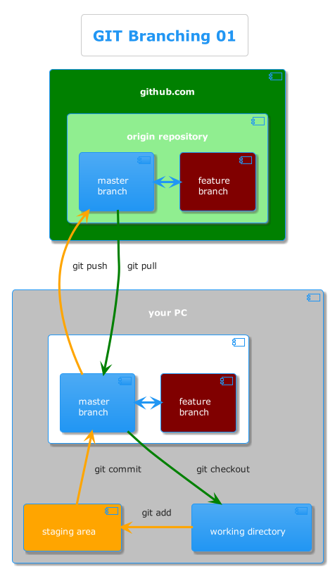
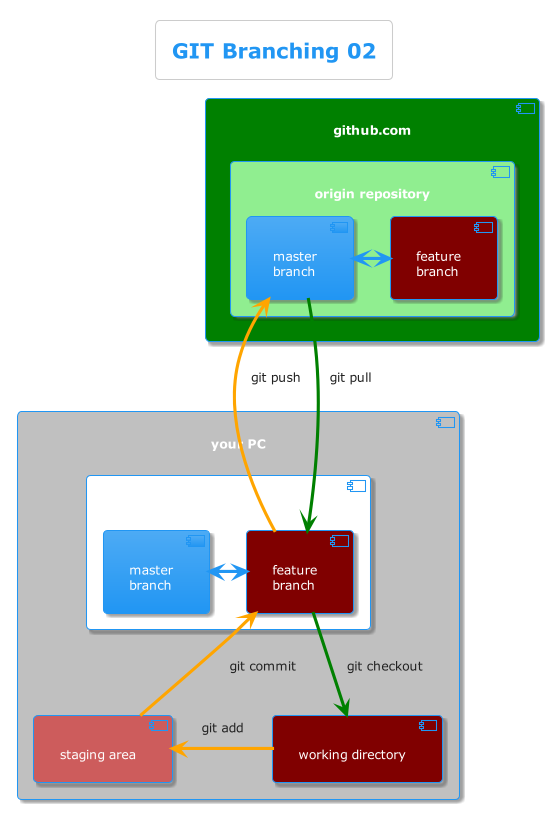

#### Git Branching

- git has a way to maintain/make copies of the project.
- in each copy you can work separated from the other copies
- they are called branches
- branches are used e.g. for new features

<!-- .element style="height:500px" class="fragment semi-fade-out" -->

<!-- .element style="height:500px" class="fragment" -->

